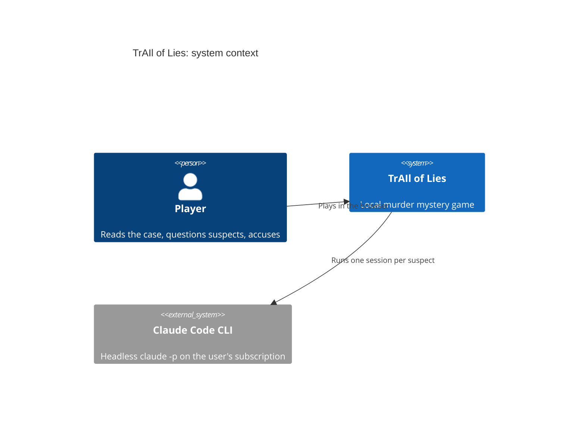

# C4 level 1: System context

```mermaid
C4Context
  title TrAIl of Lies: system context
  Person(player, "Player", "Reads the case, questions suspects, accuses")
  System(game, "TrAIl of Lies", "Local murder mystery game")
  System_Ext(claude, "Claude Code CLI", "Headless claude -p on the user's subscription")
  Rel(player, game, "Plays in the browser")
  Rel(game, claude, "Runs one session per suspect")
```

- The only external system is Claude Code on the subscription, no API (ADR-001).
